title: "EchoForge Enterprise Codebase Assessment & Governance System"
version: "v3.0"
lastUpdated: "2025-01-11"
status: "Enterprise Production"
classification: "Strategic Initiative"
compliance: ["SOX 404", "GDPR", "SOC2 Type II", "ISO27001", "PCI DSS", "HIPAA"]
stakeholders: ["Board of Directors", "C-Suite Executives", "Enterprise Architects", "Security Officers", "Compliance Teams"]
enterprise_features: ["Governance Framework", "Risk Management", "Financial ROI Tracking", "Regulatory Compliance", "Executive Dashboards"]
investment_category: "Strategic Technology Initiative"
roi_projection: "$16.2M over 24 months"
---

# Enterprise Codebase Assessment & Living Documentation System

## Table of Contents

1. [Executive Summary](#executive-summary)
2. [Phase 1: Enterprise Codebase Discovery & Risk Assessment](#phase-1-enterprise-codebase-discovery--risk-assessment)
   - [1.1 Enterprise-Grade Analysis Stack](#11-enterprise-grade-analysis-stack)
   - [1.2 Enterprise Asset Management Structure](#12-enterprise-asset-management-structure)
   - [1.3 Enterprise AI-Powered Assessment Engine](#13-enterprise-ai-powered-assessment-engine)
3. [Phase 2: Enterprise Systematic Review & Analysis](#phase-2-enterprise-systematic-review--analysis)
   - [2.1 Strategic Technology Assessment](#21-strategic-technology-assessment)
   - [2.2 Enterprise Security & Compliance Analysis](#22-enterprise-security--compliance-analysis)
   - [2.3 Business Impact & ROI Analysis](#23-business-impact--roi-analysis)
4. [Enterprise Living Documentation Framework](#enterprise-living-documentation-framework)
   - [Executive Technology Dashboard Template](#executive-technology-dashboard-template)
5. [Enterprise Governance & Risk Management Framework](#enterprise-governance--risk-management-framework)
   - [Technology Governance Structure](#technology-governance-structure)
   - [Regulatory Compliance Matrix](#regulatory-compliance-matrix)
   - [Security Control Framework](#security-control-framework)
6. [Enterprise Implementation Roadmap](#enterprise-implementation-roadmap)
   - [12-Month Enterprise Rollout Plan](#12-month-enterprise-rollout-plan)
   - [Technology Stack Standardization](#technology-stack-standardization)
   - [AI-Powered Assessment Automation](#ai-powered-assessment-automation)
7. [Enterprise Best Practices & Standards](#enterprise-best-practices--standards)
   - [Technology Governance Excellence](#technology-governance-excellence)
   - [Zero Trust Security Model](#zero-trust-security-model)
   - [Site Reliability Engineering (SRE) Practices](#site-reliability-engineering-sre-practices)
8. [Enterprise Strategic Value Measurement](#enterprise-strategic-value-measurement)
   - [Strategic Value Measurement Framework](#strategic-value-measurement-framework)
   - [Technology Excellence Maturity Model](#technology-excellence-maturity-model)
   - [Business Value Realization](#business-value-realization)
9. [Enterprise Strategic Conclusion](#enterprise-strategic-conclusion)
   - [Strategic Value Proposition](#strategic-value-proposition)
   - [Implementation Success Framework](#implementation-success-framework)
   - [Executive Action Items](#executive-action-items)

---

## Executive Summary

This enterprise-grade system provides a comprehensive framework for **continuous codebase governance, risk assessment, and strategic technology evolution**. It delivers measurable ROI through systematic technical debt reduction, security posture improvement, and development velocity optimization.

### Business Value Proposition
- **Risk Mitigation**: Proactive identification of security vulnerabilities and compliance gaps
- **Cost Optimization**: 25-40% reduction in maintenance costs through systematic technical debt management
- **Velocity Enhancement**: 15-30% improvement in development speed through optimized architecture
- **Compliance Assurance**: Automated adherence to SOX, GDPR, SOC2, and ISO27001 requirements

### Key Stakeholder Benefits
| Stakeholder | Primary Benefits | Success Metrics |
|-------------|------------------|----------------|
| **CTO/VP Engineering** | Strategic technology roadmap, risk visibility | Technical debt ratio, security score, velocity metrics |
| **Engineering Directors** | Team productivity insights, resource optimization | Sprint velocity, defect rates, code quality trends |
| **Security Team** | Vulnerability management, compliance tracking | CVE resolution time, security posture score |
| **Compliance Officers** | Audit readiness, regulatory adherence | Compliance score, audit findings reduction |

---

## Phase 1: Enterprise Codebase Discovery & Risk Assessment

### 1.1 Enterprise-Grade Analysis Stack

#### 🏢 Commercial Static Analysis Suite
- **Enterprise Security**: Veracode, Checkmarx, Fortify SCA
- **Code Quality**: SonarQube Enterprise, CodeClimate Velocity
- **Architecture**: Structure101, NDepend, Lattix
- **Compliance**: CAST Highlight, Kiuwan, Black Duck

#### 🔒 Security & Compliance Analysis
- **SAST/DAST**: Veracode, Checkmarx CxSAST, WhiteSource
- **Container Security**: Twistlock, Aqua Security, Sysdig
- **License Compliance**: FOSSA, WhiteSource, Black Duck
- **Secrets Detection**: GitGuardian, TruffleHog Enterprise

#### 📊 Enterprise Metrics & KPIs
- **Technical Debt**: SQALE methodology, CAST AIP
- **Maintainability Index**: Microsoft MI, Halstead metrics
- **Security Posture**: OWASP Risk Rating, CVE scoring
- **Performance**: APM integration (New Relic, Datadog, AppDynamics)

#### 🎯 Business Impact Analysis
- **Cost Attribution**: Development time tracking, defect cost analysis
- **Risk Quantification**: FAIR methodology, Monte Carlo simulations
- **ROI Modeling**: Technical debt paydown scenarios
- **Compliance Scoring**: Regulatory requirement mapping

---

### 1.2 Enterprise Asset Management Structure

#### 🏗️ Comprehensive Asset Inventory

```
/enterprise-codebase-assessment/
├── governance/
│   ├── compliance-matrix.json
│   ├── risk-register.json
│   ├── policy-violations.json
│   └── audit-trail.json
├── inventory/
│   ├── application-portfolio.json
│   ├── technology-stack.json
│   ├── dependency-graph.json
│   ├── api-catalog.json
│   ├── data-lineage.json
│   └── integration-map.json
├── security/
│   ├── vulnerability-assessment.json
│   ├── threat-model.json
│   ├── penetration-test-results.json
│   ├── compliance-gaps.json
│   └── security-metrics.json
├── performance/
│   ├── load-test-results.json
│   ├── performance-benchmarks.json
│   ├── scalability-analysis.json
│   └── capacity-planning.json
├── quality/
│   ├── code-quality-metrics.json
│   ├── test-coverage-analysis.json
│   ├── technical-debt-register.json
│   └── maintainability-index.json
├── business-impact/
│   ├── cost-analysis.json
│   ├── roi-projections.json
│   ├── risk-quantification.json
│   └── business-value-mapping.json
└── reporting/
    ├── executive-dashboard.json
    ├── technical-scorecards.json
    ├── compliance-reports.json
    └── trend-analysis.json
```

#### 📋 Asset Classification Framework

| Classification | Criteria | Assessment Frequency | Stakeholder Access |
|---------------|----------|---------------------|-------------------|
| **Critical** | Revenue-impacting, customer-facing | Weekly | C-Suite, Security Team |
| **High** | Core business logic, data processing | Bi-weekly | Directors, Lead Engineers |
| **Medium** | Supporting services, internal tools | Monthly | Team Leads, Architects |
| **Low** | Utilities, development tools | Quarterly | Development Teams |
### 1.3 Enterprise AI-Powered Assessment Engine

#### 🤖 Multi-Agent Assessment Architecture

##### Chief Technology Assessment Agent
```
You are an Enterprise Chief Technology Officer and Strategic Code Assessment Specialist.

CORE RESPONSIBILITIES:
1. STRATEGIC ANALYSIS:
   - Technology portfolio optimization
   - Enterprise architecture alignment
   - Digital transformation roadmap
   - Competitive technology positioning
   - Merger & acquisition technical due diligence

2. RISK MANAGEMENT:
   - Cybersecurity posture assessment
   - Regulatory compliance validation (SOX, GDPR, HIPAA)
   - Business continuity impact analysis
   - Vendor risk assessment
   - Technology obsolescence planning

3. FINANCIAL OPTIMIZATION:
   - Technical debt ROI analysis
   - Cloud migration cost-benefit modeling
   - Development velocity impact quantification
   - Infrastructure cost optimization
   - License compliance and optimization

4. GOVERNANCE & COMPLIANCE:
   - Enterprise architecture standards enforcement
   - Security policy compliance verification
   - Data governance and privacy compliance
   - Audit readiness assessment
   - Change management process validation

OUTPUT REQUIREMENTS:
- Executive-level strategic recommendations
- Quantified business impact assessments
- Risk-adjusted ROI projections
- Compliance gap analysis with remediation timelines
- Board-ready presentation materials
```

##### Security Assessment Agent
```
You are a Chief Information Security Officer (CISO) and Enterprise Security Architect.

SECURITY FOCUS AREAS:
1. Threat landscape analysis and attack surface mapping
2. Zero-trust architecture implementation assessment
3. Data classification and protection validation
4. Identity and access management review
5. Incident response capability evaluation
6. Supply chain security assessment
7. Cloud security posture management
8. DevSecOps maturity evaluation
```

##### Compliance Assessment Agent
```
You are an Enterprise Compliance Officer and Regulatory Technology Specialist.

COMPLIANCE DOMAINS:
1. SOX 404 IT controls assessment
2. GDPR data protection impact analysis
3. SOC2 Type II readiness evaluation
4. ISO27001 information security management
5. PCI DSS payment card industry compliance
6. HIPAA healthcare data protection
7. Industry-specific regulatory requirements
```

#### 🔧 Enterprise MCP Server Stack

| Server Type | Enterprise Solution | Purpose | SLA |
|-------------|-------------------|---------|-----|
| **Source Control** | GitHub Enterprise, GitLab Ultimate | Repository analysis, commit history | 99.9% |
| **Database** | Oracle Enterprise, SQL Server Enterprise | Schema analysis, data lineage | 99.95% |
| **Security** | Veracode, Checkmarx Enterprise | Vulnerability scanning, SAST/DAST | 99.5% |
| **Performance** | New Relic, Datadog Enterprise | APM integration, performance metrics | 99.9% |
| **Compliance** | ServiceNow GRC, MetricStream | Risk management, audit trails | 99.95% |
| **Documentation** | Confluence Enterprise, SharePoint | Living documentation, knowledge management | 99.5% |

## Phase 2: Enterprise Multi-Dimensional Assessment Framework

### 2.1 Strategic Technology Assessment Matrix

#### 🏛️ Enterprise Architecture Evaluation

```json
{
  "enterprise_architecture": {
    "strategic_alignment": {
      "business_capability_mapping": 8.5,
      "technology_roadmap_alignment": 7.8,
      "digital_transformation_readiness": 6.9,
      "competitive_positioning": 7.2
    },
    "architectural_governance": {
      "standards_compliance": 85,
      "reference_architecture_adherence": 78,
      "technology_stack_rationalization": 72,
      "integration_architecture_maturity": 8.1
    },
    "scalability_assessment": {
      "horizontal_scaling_readiness": "Advanced",
      "cloud_native_maturity": 7.5,
      "microservices_adoption": 65,
      "api_first_design": 8.2,
      "event_driven_architecture": 6.8
    },
    "modernization_priorities": {
      "legacy_system_risk_score": 6.5,
      "technology_debt_ratio": 18.5,
      "modernization_roi": 2.3,
      "migration_complexity": "High"
    }
  }
}
```

#### 🔒 Enterprise Security Posture Matrix

```json
{
  "security_assessment": {
    "threat_landscape": {
      "attack_surface_score": 7.2,
      "vulnerability_density": 0.8,
      "threat_model_coverage": 85,
      "security_debt_ratio": 12.5
    },
    "compliance_posture": {
      "sox_compliance_score": 92,
      "gdpr_readiness": 88,
      "soc2_type2_readiness": 85,
      "iso27001_maturity": 78,
      "industry_specific_compliance": 82
    },
    "security_controls": {
      "identity_access_management": 8.5,
      "data_protection": 7.8,
      "network_security": 8.2,
      "application_security": 7.5,
      "incident_response_readiness": 8.0
    },
    "devsecops_maturity": {
      "shift_left_security": 6.5,
      "automated_security_testing": 7.2,
      "security_pipeline_integration": 6.8,
      "security_training_coverage": 75
    }
  }
}
```

#### 💼 Business Impact & ROI Analysis

```json
{
  "business_impact_assessment": {
    "financial_metrics": {
      "development_cost_per_feature": 45000,
      "maintenance_cost_ratio": 0.35,
      "defect_cost_impact": 125000,
      "technical_debt_interest_rate": 0.23
    },
    "productivity_metrics": {
      "developer_velocity_index": 7.2,
      "deployment_frequency": "Daily",
      "lead_time_for_changes": "2.5 days",
      "mean_time_to_recovery": "4.2 hours"
    },
    "risk_quantification": {
      "business_continuity_risk": "Medium",
      "data_breach_probability": 0.15,
      "regulatory_penalty_exposure": 2500000,
      "competitive_disadvantage_risk": "Low"
    },
    "roi_projections": {
      "technical_debt_paydown_roi": 3.2,
      "security_investment_roi": 4.1,
      "modernization_roi_3yr": 2.8,
      "automation_roi": 5.5
    }
  }
}
```
### 2.2 Enterprise Opportunity Portfolio Management

#### 🎯 Strategic Investment Categories

##### 💰 High-ROI Technical Investments

| Category | Investment Range | Expected ROI | Timeline | Risk Level |
|----------|-----------------|--------------|----------|------------|
| **Database Optimization** | $50K - $200K | 300-500% | 3-6 months | Low |
| **Cloud Migration** | $200K - $2M | 200-400% | 6-18 months | Medium |
| **API Modernization** | $100K - $500K | 250-450% | 4-12 months | Low |
| **Security Hardening** | $150K - $800K | 400-600% | 3-9 months | Low |
| **DevOps Automation** | $75K - $300K | 350-550% | 2-6 months | Low |

##### 🛡️ Risk Mitigation Priorities

| Risk Category | Business Impact | Mitigation Cost | Timeline | Compliance Requirement |
|---------------|----------------|-----------------|----------|------------------------|
| **Data Breach** | $5M - $50M | $200K - $1M | 3-6 months | GDPR, SOX |
| **System Outage** | $100K/hour | $150K - $500K | 2-4 months | SOC2 |
| **Compliance Violation** | $1M - $10M | $100K - $300K | 1-3 months | Industry-specific |
| **Legacy System Failure** | $500K - $5M | $300K - $2M | 6-12 months | Business continuity |

##### 🚀 Innovation & Competitive Advantage

- **AI/ML Integration**: Predictive analytics, intelligent automation
- **Edge Computing**: Latency reduction, distributed processing
- **Blockchain Integration**: Supply chain transparency, smart contracts
- **IoT Platform**: Real-time monitoring, predictive maintenance
- **Advanced Analytics**: Business intelligence, customer insights

##### 📊 Operational Excellence Initiatives

- **Site Reliability Engineering**: 99.99% uptime targets
- **Chaos Engineering**: Resilience testing and improvement
- **Observability Platform**: Full-stack monitoring and alerting
- **Automated Testing**: 90%+ code coverage, shift-left testing
- **Documentation Automation**: Self-updating technical documentation

### 2.3 Enterprise Living Documentation Framework

#### 📊 Executive Technology Dashboard Template

```markdown
# Enterprise Technology Portfolio Assessment
## [Business Unit/Division Name]

### 📈 Executive Summary

**Assessment Period**: Q[X] [Year] | **Next Review**: [Date]
**Assessment Confidence**: [High/Medium/Low] | **Data Quality Score**: [0-100]

#### Key Performance Indicators

| Metric | Current | Target | Trend | Risk Level |
|--------|---------|--------|-------|------------|
| **Technical Debt Ratio** | 18.5% | <15% | ↗️ Improving | Medium |
| **Security Posture Score** | 8.2/10 | >8.5 | ↗️ Improving | Low |
| **System Availability** | 99.7% | 99.9% | ↘️ Declining | High |
| **Development Velocity** | 7.2/10 | >8.0 | → Stable | Medium |
| **Compliance Score** | 87% | >90% | ↗️ Improving | Medium |

#### 💰 Financial Impact Summary

- **Annual Technology Spend**: $[X]M
- **Technical Debt Cost**: $[X]M (estimated annual impact)
- **Security Investment**: $[X]M
- **Projected ROI (3-year)**: [X]%
- **Cost Avoidance**: $[X]M (risk mitigation value)

#### 🎯 Strategic Priorities (Next 12 Months)

1. **[Priority 1]** - Investment: $[X]K, ROI: [X]%, Timeline: [X] months
2. **[Priority 2]** - Investment: $[X]K, ROI: [X]%, Timeline: [X] months
3. **[Priority 3]** - Investment: $[X]K, ROI: [X]%, Timeline: [X] months

#### ⚠️ Critical Risk Factors

| Risk | Probability | Impact | Mitigation Status | Owner |
|------|-------------|--------|------------------|-------|
| **[Risk 1]** | High | $[X]M | In Progress | [Name] |
| **[Risk 2]** | Medium | $[X]M | Planned | [Name] |
| **[Risk 3]** | Low | $[X]M | Monitoring | [Name] |

### 🏗️ Technology Architecture Overview

#### Current State Architecture
- **Architecture Pattern**: [Microservices/Monolith/Hybrid]
- **Cloud Strategy**: [Multi-cloud/Single-cloud/Hybrid/On-premise]
- **Data Architecture**: [Data lake/Data warehouse/Hybrid]
- **Integration Pattern**: [API-first/Event-driven/Batch]

#### Technology Stack Rationalization

| Category | Current Count | Target Count | Rationalization Status |
|----------|---------------|--------------|------------------------|
| **Programming Languages** | 12 | 6 | 50% complete |
| **Databases** | 8 | 4 | 25% complete |
| **Cloud Services** | 45 | 30 | 10% complete |
| **Monitoring Tools** | 6 | 3 | 75% complete |

### 🔒 Security & Compliance Posture

#### Compliance Status

| Framework | Status | Score | Last Audit | Next Audit |
|-----------|--------|-------|------------|------------|
| **SOX 404** | ✅ Compliant | 92% | [Date] | [Date] |
| **GDPR** | ⚠️ Gaps Identified | 88% | [Date] | [Date] |
| **SOC2 Type II** | ✅ Compliant | 85% | [Date] | [Date] |
| **ISO27001** | 🔄 In Progress | 78% | [Date] | [Date] |

#### Security Metrics

- **Mean Time to Patch**: [X] days (Target: <7 days)
- **Vulnerability Density**: [X] per 1000 LOC
- **Security Training Completion**: [X]%
- **Incident Response Time**: [X] hours (Target: <4 hours)

### 📊 Development & Operations Metrics

#### DORA Metrics

| Metric | Current | Industry Benchmark | Performance Level |
|--------|---------|-------------------|-------------------|
| **Deployment Frequency** | Daily | Multiple/day | Medium |
| **Lead Time for Changes** | 2.5 days | <1 day | Medium |
| **Change Failure Rate** | 8% | <5% | Medium |
| **Mean Time to Recovery** | 4.2 hours | <1 hour | Low |

#### Quality Metrics

- **Code Coverage**: [X]% (Target: >80%)
- **Defect Density**: [X] per 1000 LOC
- **Customer Satisfaction**: [X]/10
- **System Performance**: [X]ms avg response time

### 🚀 Innovation & Future State

#### Emerging Technology Adoption

| Technology | Maturity | Business Value | Investment Priority |
|------------|----------|----------------|--------------------||
| **AI/ML** | Pilot | High | High |
| **Edge Computing** | Research | Medium | Medium |
| **Blockchain** | Research | Low | Low |
| **Quantum Computing** | Monitoring | Unknown | Low |

#### Digital Transformation Roadmap

- **Phase 1 (0-6 months)**: [Key initiatives]
- **Phase 2 (6-18 months)**: [Key initiatives]
- **Phase 3 (18-36 months)**: [Key initiatives]

### 📋 Action Items & Recommendations

#### Immediate Actions (0-30 days)
1. **[Action 1]** - Owner: [Name], Budget: $[X]K
2. **[Action 2]** - Owner: [Name], Budget: $[X]K

#### Short-term Initiatives (1-6 months)
1. **[Initiative 1]** - Owner: [Name], Budget: $[X]K, ROI: [X]%
2. **[Initiative 2]** - Owner: [Name], Budget: $[X]K, ROI: [X]%

#### Long-term Strategic Investments (6+ months)
1. **[Investment 1]** - Owner: [Name], Budget: $[X]M, ROI: [X]%
2. **[Investment 2]** - Owner: [Name], Budget: $[X]M, ROI: [X]%

---

**Document Classification**: Internal Use Only
**Next Review Date**: [Date]
**Document Owner**: [CTO/VP Engineering]
**Stakeholder Distribution**: C-Suite, Engineering Leadership, Security Team
```

## Phase 3: Enterprise Governance & Risk Management Framework

### 3.1 🏛️ Technology Governance Structure

#### Enterprise Architecture Review Board (EARB)

| Role | Responsibility | Decision Authority | Meeting Frequency |
|------|----------------|-------------------|-------------------|
| **Chief Technology Officer** | Strategic technology direction | Final approval on major initiatives | Monthly |
| **Enterprise Architect** | Standards and patterns governance | Architecture compliance enforcement | Weekly |
| **Security Architect** | Security policy and compliance | Security exception approval | Bi-weekly |
| **Data Architect** | Data governance and privacy | Data classification decisions | Monthly |
| **Infrastructure Architect** | Platform and infrastructure standards | Infrastructure investment approval | Monthly |

#### 📋 Technology Decision Framework

```json
{
  "decision_criteria": {
    "strategic_alignment": {
      "weight": 30,
      "factors": ["Business capability support", "Technology roadmap fit", "Competitive advantage"]
    },
    "risk_assessment": {
      "weight": 25,
      "factors": ["Security posture", "Compliance impact", "Operational risk"]
    },
    "financial_impact": {
      "weight": 25,
      "factors": ["Total cost of ownership", "ROI projection", "Budget alignment"]
    },
    "technical_merit": {
      "weight": 20,
      "factors": ["Scalability", "Maintainability", "Integration complexity"]
    }
  },
  "approval_thresholds": {
    "low_impact": {"budget": "<$50K", "approver": "Technical Lead"},
    "medium_impact": {"budget": "$50K-$500K", "approver": "Engineering Director"},
    "high_impact": {"budget": ">$500K", "approver": "EARB"}
  }
}
```

### 3.2 🔒 Enterprise Security & Compliance Framework

#### Regulatory Compliance Matrix

| Regulation | Scope | Key Requirements | Assessment Frequency | Compliance Score |
|------------|-------|------------------|---------------------|------------------|
| **SOX 404** | Financial systems | IT controls, change management | Quarterly | 92% |
| **GDPR** | EU data processing | Data protection, privacy by design | Semi-annually | 88% |
| **SOC2 Type II** | Service organizations | Security, availability, confidentiality | Annually | 85% |
| **ISO27001** | Information security | ISMS, risk management | Annually | 78% |
| **PCI DSS** | Payment processing | Cardholder data protection | Quarterly | 94% |
| **HIPAA** | Healthcare data | PHI protection, access controls | Semi-annually | 91% |

#### 🛡️ Security Control Framework

```json
{
  "security_controls": {
    "preventive_controls": {
      "access_management": {
        "implementation": "Azure AD + Okta",
        "coverage": 95,
        "effectiveness": "High",
        "last_review": "2025-07-15"
      },
      "code_security": {
        "static_analysis": "Veracode, SonarQube Enterprise",
        "dynamic_analysis": "Checkmarx DAST",
        "coverage": 88,
        "false_positive_rate": 12
      }
    },
    "detective_controls": {
      "monitoring": {
        "siem_platform": "Splunk Enterprise Security",
        "coverage": 92,
        "alert_response_time": "<15 minutes"
      },
      "vulnerability_management": {
        "scanning_frequency": "Daily",
        "critical_patch_sla": "72 hours",
        "compliance_rate": 94
      }
    },
    "corrective_controls": {
      "incident_response": {
        "response_time": "<4 hours",
        "escalation_procedures": "Defined",
        "recovery_time_objective": "<24 hours"
      }
    }
  }
}
```

### 3.3 📊 Enterprise Risk Management

#### Technology Risk Register

| Risk ID | Risk Category | Description | Probability | Impact | Risk Score | Mitigation Strategy | Owner |
|---------|---------------|-------------|-------------|--------|------------|-------------------|-------|
| **TR-001** | Security | Data breach via API vulnerabilities | Medium | Very High | 20 | API security hardening, WAF deployment | CISO |
| **TR-002** | Operational | Legacy system failure | High | High | 16 | Modernization roadmap, backup systems | CTO |
| **TR-003** | Compliance | GDPR violation | Low | Very High | 15 | Privacy by design, data governance | DPO |
| **TR-004** | Financial | Cloud cost overrun | Medium | Medium | 9 | Cost monitoring, resource optimization | CFO |
| **TR-005** | Strategic | Technology obsolescence | High | Medium | 12 | Technology refresh cycle, innovation fund | CTO |

#### 🎯 Risk Mitigation Roadmap

```json
{
  "risk_mitigation_plan": {
    "immediate_actions": [
      {
        "risk_id": "TR-001",
        "action": "Deploy Web Application Firewall",
        "timeline": "30 days",
        "budget": "$150K",
        "expected_risk_reduction": "60%"
      }
    ],
    "short_term_initiatives": [
      {
        "risk_id": "TR-002",
        "action": "Legacy system assessment and modernization planning",
        "timeline": "6 months",
        "budget": "$500K",
        "expected_risk_reduction": "75%"
      }
    ],
    "long_term_strategic": [
      {
        "risk_id": "TR-005",
        "action": "Technology innovation program",
        "timeline": "24 months",
        "budget": "$2M",
        "expected_risk_reduction": "80%"
      }
    ]
  }
}
```

### 3.4 🔄 Continuous Improvement Framework

#### Technology Maturity Assessment

| Capability | Current Maturity | Target Maturity | Gap Analysis | Investment Required |
|------------|------------------|-----------------|--------------|--------------------||
| **DevOps** | Level 3 (Defined) | Level 4 (Managed) | Automation gaps, metrics | $300K |
| **Security** | Level 4 (Managed) | Level 5 (Optimizing) | Threat intelligence, AI/ML | $500K |
| **Data Management** | Level 2 (Repeatable) | Level 4 (Managed) | Governance, quality | $800K |
| **Cloud Native** | Level 3 (Defined) | Level 5 (Optimizing) | Microservices, observability | $1.2M |
| **AI/ML** | Level 1 (Initial) | Level 3 (Defined) | Platform, skills, governance | $1.5M |

#### 📈 Performance Measurement Framework

```json
{
  "kpi_framework": {
    "technical_excellence": {
      "code_quality_index": {"current": 7.8, "target": 8.5, "trend": "improving"},
      "technical_debt_ratio": {"current": 18.5, "target": 15.0, "trend": "stable"},
      "automated_test_coverage": {"current": 78, "target": 85, "trend": "improving"}
    },
    "operational_excellence": {
      "system_availability": {"current": 99.7, "target": 99.9, "trend": "declining"},
      "deployment_frequency": {"current": "daily", "target": "multiple/day", "trend": "stable"},
      "incident_resolution_time": {"current": 4.2, "target": 2.0, "trend": "improving"}
    },
    "business_alignment": {
      "feature_delivery_velocity": {"current": 7.2, "target": 8.0, "trend": "stable"},
      "customer_satisfaction": {"current": 8.1, "target": 8.5, "trend": "improving"},
      "time_to_market": {"current": 45, "target": 30, "trend": "improving"}
    }
  }
}
```

## Phase 4: Enterprise Implementation Roadmap

### 4.1 🚀 Strategic Implementation Framework

#### 📅 12-Month Enterprise Rollout Plan

| Phase | Duration | Key Deliverables | Investment | Success Criteria |
|-------|----------|------------------|------------|-------------------|
| **Foundation** | Months 1-3 | Governance structure, tooling setup | $500K | Baseline metrics established |
| **Pilot** | Months 4-6 | 3 critical applications assessed | $300K | 90% compliance score |
| **Scale** | Months 7-9 | Portfolio-wide assessment | $800K | 50% technical debt reduction |
| **Optimize** | Months 10-12 | Continuous improvement, automation | $400K | Industry-leading metrics |

#### 🎯 Phase 1: Foundation (Months 1-3)

**Week 1-4: Governance & Organization**
- Establish Enterprise Architecture Review Board (EARB)
- Define technology governance policies and procedures
- Create risk management framework and processes
- Set up compliance monitoring and reporting structure

**Week 5-8: Tooling & Infrastructure**
- Deploy enterprise-grade analysis tools (Veracode, SonarQube Enterprise)
- Implement security scanning pipeline (Checkmarx, SAST/DAST)
- Set up compliance monitoring dashboard (ServiceNow GRC)
- Configure performance monitoring (New Relic, Datadog)

**Week 9-12: Baseline Assessment**
- Conduct comprehensive portfolio inventory
- Establish baseline metrics and KPIs
- Create initial risk register and compliance matrix
- Develop executive reporting templates

#### 🔬 Phase 2: Pilot Program (Months 4-6)

**Critical Application Selection Criteria:**
- High business impact and revenue dependency
- Regulatory compliance requirements
- Technical complexity and integration points
- Team readiness and stakeholder buy-in

**Pilot Success Metrics:**
```json
{
  "pilot_kpis": {
    "security_posture": {"baseline": 6.5, "target": 8.0, "achieved": 8.2},
    "technical_debt_ratio": {"baseline": 25, "target": 18, "achieved": 16.5},
    "compliance_score": {"baseline": 75, "target": 90, "achieved": 92},
    "development_velocity": {"baseline": 6.0, "target": 7.5, "achieved": 7.8}
  }
}
```

### 4.2 🏗️ Enterprise Architecture Integration

#### Technology Stack Standardization

| Category | Current State | Target State | Migration Strategy | Timeline |
|----------|---------------|--------------|-------------------|----------|
| **Languages** | 12 languages | 6 core languages | Gradual migration, new project standards | 18 months |
| **Databases** | 8 different DBs | 4 strategic platforms | Data migration, service consolidation | 24 months |
| **Cloud Services** | 45+ services | 30 optimized services | Service rationalization, cost optimization | 12 months |
| **Monitoring** | 6 tools | 3 integrated platforms | Tool consolidation, unified dashboards | 6 months |

#### 🔄 CI/CD Pipeline Enhancement

```yaml
# Enterprise CI/CD Pipeline Configuration
name: Enterprise Assessment Pipeline

stages:
  - security-scan:
      tools: ["Veracode", "Checkmarx", "GitGuardian"]
      gates: ["Critical vulnerabilities: 0", "High vulnerabilities: <5"]
      
  - quality-analysis:
      tools: ["SonarQube Enterprise", "NDepend", "Structure101"]
      gates: ["Technical debt ratio: <15%", "Code coverage: >80%"]
      
  - compliance-check:
      frameworks: ["SOX", "GDPR", "SOC2", "ISO27001"]
      gates: ["Compliance score: >90%", "Policy violations: 0"]
      
  - performance-test:
      tools: ["LoadRunner", "JMeter", "K6"]
      gates: ["Response time: <200ms", "Throughput: >1000 TPS"]
      
  - deployment:
      strategy: "Blue-Green"
      rollback: "Automated on failure"
      monitoring: "Real-time alerts"
```

### 4.3 🤖 AI-Powered Assessment Automation

#### Machine Learning Integration

```json
{
  "ai_capabilities": {
    "predictive_analytics": {
      "technical_debt_forecasting": {
        "model": "Time series analysis with LSTM",
        "accuracy": 87,
        "prediction_horizon": "6 months",
        "update_frequency": "Weekly"
      },
      "security_risk_prediction": {
        "model": "Random Forest with threat intelligence",
        "accuracy": 92,
        "false_positive_rate": 8,
        "alert_threshold": "High confidence (>85%)"
      }
    },
    "automated_remediation": {
      "code_quality_fixes": {
        "coverage": "40% of common issues",
        "success_rate": 95,
        "human_review_required": "Security-related changes"
      },
      "dependency_updates": {
        "automation_level": "Patch and minor versions",
        "testing_required": "Automated test suite pass",
        "rollback_capability": "Automated"
      }
    }
  }
}
```

### 4.4 📊 Enterprise Reporting & Dashboards

#### Executive Dashboard Configuration

```json
{
  "executive_dashboard": {
    "refresh_frequency": "Real-time",
    "data_sources": ["SonarQube", "Veracode", "New Relic", "ServiceNow"],
    "widgets": [
      {
        "type": "kpi_scorecard",
        "metrics": ["Technical Debt Ratio", "Security Score", "Compliance %"],
        "visualization": "Traffic light with trend arrows"
      },
      {
        "type": "risk_heatmap",
        "dimensions": ["Probability", "Impact"],
        "color_coding": "Red/Amber/Green"
      },
      {
        "type": "investment_roi",
        "timeframe": "3-year projection",
        "scenarios": ["Conservative", "Likely", "Optimistic"]
      }
    ]
  }
}
```

#### 📈 Stakeholder-Specific Views

| Stakeholder | Key Metrics | Update Frequency | Format |
|-------------|-------------|------------------|--------|
| **CEO/Board** | ROI, Risk exposure, Compliance status | Monthly | Executive summary |
| **CTO** | Technical debt, Architecture health, Innovation metrics | Weekly | Technical dashboard |
| **CISO** | Security posture, Vulnerability trends, Incident metrics | Daily | Security scorecard |
| **Engineering Directors** | Team velocity, Code quality, Delivery metrics | Daily | Operational dashboard |
| **Compliance Officers** | Audit readiness, Policy adherence, Gap analysis | Weekly | Compliance report |

## Phase 5: Enterprise Best Practices & Standards

### 5.1 🏆 Enterprise Governance Best Practices

#### Technology Governance Excellence

| Practice Area | Best Practice | Implementation | Success Metrics |
|---------------|---------------|----------------|----------------|
| **Decision Making** | Evidence-based technology decisions | Data-driven evaluation framework | 95% decisions backed by quantitative analysis |
| **Standards Compliance** | Automated policy enforcement | CI/CD pipeline integration | 98% compliance rate across portfolio |
| **Risk Management** | Proactive risk identification | AI-powered risk prediction | 80% reduction in critical incidents |
| **Investment Optimization** | Portfolio-based resource allocation | ROI-driven prioritization | 25% improvement in technology ROI |

#### 📋 Governance Framework Implementation

```json
{
  "governance_maturity": {
    "level_1_initial": {
      "characteristics": ["Ad-hoc decisions", "Reactive approach", "Limited visibility"],
      "improvement_actions": ["Establish EARB", "Define policies", "Implement basic metrics"]
    },
    "level_2_managed": {
      "characteristics": ["Defined processes", "Regular reviews", "Basic compliance"],
      "improvement_actions": ["Automate compliance", "Enhance metrics", "Improve integration"]
    },
    "level_3_defined": {
      "characteristics": ["Standardized processes", "Integrated tools", "Proactive management"],
      "improvement_actions": ["Optimize automation", "Predictive analytics", "Continuous improvement"]
    },
    "level_4_quantitatively_managed": {
      "characteristics": ["Data-driven decisions", "Predictive capabilities", "Optimized processes"],
      "improvement_actions": ["AI integration", "Advanced analytics", "Innovation focus"]
    },
    "level_5_optimizing": {
      "characteristics": ["Continuous optimization", "Innovation-driven", "Industry leadership"],
      "improvement_actions": ["Thought leadership", "Ecosystem influence", "Breakthrough innovation"]
    }
  }
}
```

### 5.2 🔒 Security & Compliance Excellence

#### Zero Trust Security Model

| Component | Implementation | Verification | Compliance Impact |
|-----------|----------------|--------------|-------------------|
| **Identity Verification** | Multi-factor authentication, privileged access management | Continuous authentication monitoring | SOC2, ISO27001 |
| **Device Security** | Endpoint detection and response, device compliance | Real-time device health monitoring | NIST Cybersecurity Framework |
| **Network Segmentation** | Micro-segmentation, software-defined perimeters | Network traffic analysis | PCI DSS, HIPAA |
| **Data Protection** | Encryption at rest and in transit, data loss prevention | Data classification and monitoring | GDPR, CCPA |

#### 🛡️ Compliance Automation Framework

```json
{
  "compliance_automation": {
    "policy_as_code": {
      "implementation": "Open Policy Agent (OPA)",
      "coverage": 85,
      "automation_rate": 92,
      "manual_exceptions": 8
    },
    "continuous_monitoring": {
      "tools": ["Splunk SOAR", "ServiceNow GRC", "AWS Config"],
      "real_time_alerts": true,
      "compliance_dashboard": "Executive and operational views",
      "audit_trail": "Immutable blockchain-based logging"
    },
    "automated_remediation": {
      "coverage": "70% of common violations",
      "response_time": "<5 minutes",
      "success_rate": 94,
      "escalation_procedures": "Defined for complex issues"
    }
  }
}
```

### 5.3 📊 Operational Excellence Standards

#### Site Reliability Engineering (SRE) Practices

| SRE Principle | Implementation | Target SLI | Current Performance |
|---------------|----------------|------------|--------------------||
| **Availability** | Multi-region deployment, circuit breakers | 99.95% uptime | 99.97% |
| **Latency** | CDN, caching, performance optimization | <200ms p95 | 185ms p95 |
| **Error Rate** | Comprehensive monitoring, automated recovery | <0.1% error rate | 0.08% |
| **Throughput** | Auto-scaling, load balancing | >10,000 RPS | 12,500 RPS |

#### 🔄 DevOps Maturity Framework

```json
{
  "devops_capabilities": {
    "deployment_automation": {
      "current_state": "Fully automated with rollback",
      "deployment_frequency": "Multiple times per day",
      "lead_time": "<2 hours",
      "failure_rate": "<5%",
      "recovery_time": "<30 minutes"
    },
    "monitoring_observability": {
      "coverage": "Full-stack observability",
      "tools": ["Datadog", "New Relic", "Grafana"],
      "alerting": "Intelligent, context-aware alerts",
      "dashboards": "Role-based, real-time dashboards"
    },
    "quality_assurance": {
      "test_automation": "95% automated test coverage",
      "shift_left_testing": "Security and performance testing in CI/CD",
      "quality_gates": "Automated quality gates with override capability",
      "feedback_loops": "Real-time quality metrics"
    }
  }
}
```

### 5.4 🚀 Innovation & Continuous Improvement

#### Technology Innovation Framework

| Innovation Stage | Activities | Investment | Success Criteria |
|------------------|------------|------------|------------------|
| **Exploration** | Technology scouting, proof of concepts | 10% of tech budget | 5 POCs per quarter |
| **Experimentation** | Pilot projects, MVP development | 20% of tech budget | 2 successful pilots per quarter |
| **Adoption** | Production deployment, scaling | 30% of tech budget | 80% adoption rate within 12 months |
| **Optimization** | Performance tuning, cost optimization | 40% of tech budget | 15% efficiency improvement annually |

#### 📈 Continuous Improvement Culture

```json
{
  "improvement_culture": {
    "learning_organization": {
      "practices": [
        "Regular retrospectives and post-mortems",
        "Knowledge sharing sessions and tech talks",
        "Cross-functional collaboration initiatives",
        "External conference participation and speaking"
      ],
      "metrics": {
        "learning_hours_per_employee": 40,
        "internal_knowledge_sharing_sessions": 24,
        "cross_team_collaboration_projects": 12,
        "external_speaking_engagements": 8
      }
    },
    "experimentation_mindset": {
      "practices": [
        "Hypothesis-driven development",
        "A/B testing for feature releases",
        "Fail-fast mentality with learning focus",
        "Innovation time allocation (20% rule)"
      ],
      "success_metrics": {
        "experiments_per_quarter": 50,
        "successful_experiment_rate": 30,
        "time_to_experiment_results": "<2 weeks",
        "innovation_project_participation": 80
      }
    }
  }
}
```

### 5.5 🎯 Performance Optimization Standards

#### Application Performance Management (APM)

| Performance Area | Standard | Monitoring Tool | Alert Threshold |
|------------------|----------|-----------------|----------------|
| **Response Time** | <200ms p95 | New Relic, Datadog | >250ms p95 |
| **Throughput** | >10,000 RPS | Application metrics | <8,000 RPS |
| **Error Rate** | <0.1% | Error tracking tools | >0.2% |
| **Resource Utilization** | <70% CPU/Memory | Infrastructure monitoring | >80% sustained |

#### 🔧 Performance Engineering Practices

```json
{
  "performance_engineering": {
    "proactive_optimization": {
      "performance_budgets": "Defined for all critical user journeys",
      "continuous_profiling": "Production profiling with minimal overhead",
      "capacity_planning": "Predictive scaling based on usage patterns",
      "performance_testing": "Automated load testing in CI/CD pipeline"
    },
    "reactive_optimization": {
      "performance_incident_response": "<15 minutes detection, <1 hour resolution",
      "root_cause_analysis": "Automated RCA with ML-powered insights",
      "performance_post_mortems": "Blameless culture with improvement focus",
      "optimization_tracking": "Performance improvement metrics and trends"
    }
  }
}
```

## Phase 6: Enterprise Success Measurement & Value Realization

### 6.1 📊 Strategic Value Measurement Framework

#### Enterprise KPI Dashboard

| Category | Metric | Current | Target | Business Impact | Measurement Frequency |
|----------|--------|---------|--------|-----------------|----------------------|
| **Financial** | Technology ROI | 18% | 25% | $5.2M annual value | Monthly |
| **Risk** | Critical vulnerabilities | 12 | 0 | 85% risk reduction | Daily |
| **Compliance** | Regulatory adherence | 87% | 95% | Audit cost savings $800K | Quarterly |
| **Innovation** | Time to market | 45 days | 30 days | 33% faster delivery | Weekly |
| **Quality** | Production incidents | 24/month | 10/month | 58% improvement | Daily |

#### 💰 Financial Impact Measurement

```json
{
  "financial_metrics": {
    "cost_avoidance": {
      "security_incidents_prevented": {
        "annual_value": "$3.2M",
        "calculation": "Average incident cost ($400K) × Incidents prevented (8)",
        "confidence_level": "High (85%)"
      },
      "compliance_violations_avoided": {
        "annual_value": "$1.8M",
        "calculation": "Average fine ($600K) × Violations prevented (3)",
        "confidence_level": "Medium (70%)"
      }
    },
    "efficiency_gains": {
      "development_productivity": {
        "annual_value": "$2.4M",
        "calculation": "Developer time saved (2,400 hours) × Loaded rate ($1,000/hour)",
        "confidence_level": "High (90%)"
      },
      "operational_efficiency": {
        "annual_value": "$1.6M",
        "calculation": "Reduced maintenance effort × Operational cost savings",
        "confidence_level": "Medium (75%)"
      }
    },
    "revenue_impact": {
      "faster_time_to_market": {
        "annual_value": "$4.8M",
        "calculation": "Revenue acceleration from 33% faster delivery",
        "confidence_level": "Medium (65%)"
      },
      "improved_customer_satisfaction": {
        "annual_value": "$2.1M",
        "calculation": "Customer retention improvement × Average customer value",
        "confidence_level": "Low (55%)"
      }
    }
  }
}
```

### 6.2 🎯 Maturity-Based Success Criteria

#### Technology Excellence Maturity Model

| Capability | Level 1 (Initial) | Level 2 (Managed) | Level 3 (Defined) | Level 4 (Quantitative) | Level 5 (Optimizing) |
|------------|-------------------|-------------------|-------------------|------------------------|----------------------|
| **Code Quality** | Ad-hoc reviews | Basic automation | Standardized process | Metrics-driven | Continuous optimization |
| **Security** | Reactive patching | Regular scanning | Integrated pipeline | Risk-based approach | Predictive security |
| **Performance** | Issue-driven | Monitoring setup | Proactive optimization | SLA-driven | Self-healing systems |
| **Compliance** | Manual audits | Basic automation | Policy as code | Continuous compliance | Adaptive governance |

#### 📈 Progression Roadmap (24-Month Journey)

```json
{
  "maturity_progression": {
    "months_1_6": {
      "focus": "Foundation Building",
      "target_level": "Level 2 (Managed)",
      "key_initiatives": [
        "Establish governance structure",
        "Deploy enterprise tooling",
        "Create baseline metrics",
        "Train core teams"
      ],
      "success_criteria": {
        "governance_score": 6.0,
        "tool_adoption": 80,
        "team_engagement": 75,
        "baseline_established": true
      }
    },
    "months_7_12": {
      "focus": "Process Standardization",
      "target_level": "Level 3 (Defined)",
      "key_initiatives": [
        "Standardize assessment processes",
        "Implement continuous monitoring",
        "Enhance automation",
        "Expand portfolio coverage"
      ],
      "success_criteria": {
        "process_standardization": 90,
        "automation_coverage": 85,
        "portfolio_coverage": 95,
        "compliance_score": 90
      }
    },
    "months_13_18": {
      "focus": "Quantitative Management",
      "target_level": "Level 4 (Quantitative)",
      "key_initiatives": [
        "Implement predictive analytics",
        "Optimize based on metrics",
        "Enhance decision support",
        "Achieve industry benchmarks"
      ],
      "success_criteria": {
        "predictive_accuracy": 85,
        "decision_support_usage": 90,
        "benchmark_achievement": 80,
        "roi_realization": 25
      }
    },
    "months_19_24": {
      "focus": "Continuous Optimization",
      "target_level": "Level 5 (Optimizing)",
      "key_initiatives": [
        "AI-powered optimization",
        "Self-healing capabilities",
        "Innovation acceleration",
        "Industry leadership"
      ],
      "success_criteria": {
        "ai_integration": 70,
        "self_healing_coverage": 60,
        "innovation_metrics": 40,
        "industry_recognition": true
      }
    }
  }
}
```

### 6.3 🏆 Business Value Realization

#### Value Stream Optimization

| Value Stream | Current State | Future State | Improvement | Business Impact |
|--------------|---------------|--------------|-------------|----------------|
| **Idea to Production** | 45 days | 20 days | 56% faster | $4.8M revenue acceleration |
| **Issue to Resolution** | 4.2 hours | 1.5 hours | 64% faster | $2.1M operational savings |
| **Compliance to Audit** | 120 days | 30 days | 75% faster | $1.2M cost reduction |
| **Risk to Mitigation** | 15 days | 3 days | 80% faster | $3.5M risk avoidance |

#### 📊 Executive Value Dashboard

```json
{
  "executive_value_metrics": {
    "strategic_alignment": {
      "technology_business_alignment": 8.5,
      "innovation_pipeline_health": 7.8,
      "competitive_advantage_score": 8.2,
      "digital_transformation_progress": 75
    },
    "operational_excellence": {
      "system_reliability": 99.97,
      "security_posture_score": 9.1,
      "compliance_readiness": 94,
      "operational_efficiency": 87
    },
    "financial_performance": {
      "technology_roi": 24.5,
      "cost_optimization_achieved": 18.2,
      "revenue_impact": 12.8,
      "investment_efficiency": 91
    },
    "organizational_capability": {
      "team_productivity_index": 8.7,
      "skill_development_score": 8.3,
      "innovation_culture_rating": 7.9,
      "change_readiness": 85
    }
  }
}
```

### 6.4 🔄 Continuous Value Enhancement

#### Value Optimization Cycle

| Phase | Duration | Activities | Success Metrics | Next Phase Trigger |
|-------|----------|------------|-----------------|-------------------|
| **Measure** | 2 weeks | Data collection, analysis | Baseline established | Data quality >95% |
| **Analyze** | 1 week | Pattern identification, insights | Insights documented | Action plan created |
| **Improve** | 4-8 weeks | Implementation, optimization | Improvement targets met | Results validated |
| **Control** | 2 weeks | Monitoring, standardization | Process stabilized | Next cycle initiated |

#### 🚀 Innovation Impact Measurement

```json
{
  "innovation_metrics": {
    "technology_adoption": {
      "emerging_tech_experiments": 12,
      "successful_poc_rate": 35,
      "production_adoption_rate": 80,
      "innovation_investment_roi": 28
    },
    "capability_development": {
      "new_capabilities_delivered": 8,
      "capability_maturity_improvement": 2.3,
      "cross_functional_collaboration": 85,
      "knowledge_sharing_index": 7.8
    },
    "market_differentiation": {
      "unique_value_propositions": 5,
      "competitive_advantage_duration": 18,
      "customer_satisfaction_improvement": 12,
      "market_share_impact": 3.2
    }
  }
}
```

### 6.5 📋 Stakeholder Value Communication

#### Value Communication Framework

| Audience | Key Messages | Delivery Format | Frequency | Success Indicators |
|----------|--------------|-----------------|-----------|-------------------|
| **Board/CEO** | Strategic value, ROI, risk mitigation | Executive summary, dashboard | Quarterly | Investment approval, strategic alignment |
| **CTO/Engineering** | Technical excellence, innovation, efficiency | Technical metrics, roadmaps | Monthly | Team engagement, capability improvement |
| **CFO/Finance** | Cost optimization, ROI, budget efficiency | Financial reports, business cases | Monthly | Budget approval, cost targets met |
| **CISO/Security** | Risk reduction, compliance, security posture | Security scorecards, risk reports | Weekly | Risk acceptance, compliance achievement |
| **Business Units** | Feature delivery, quality, customer impact | Business metrics, user feedback | Bi-weekly | Satisfaction scores, adoption rates |

---

## Enterprise Strategic Conclusion

### 🏆 Strategic Value Proposition

EchoForge's Enterprise Codebase Assessment & Governance System represents a **$16.2M strategic investment** that transforms organizational technology capabilities from reactive maintenance to proactive strategic advantage. This enterprise-grade system delivers measurable business value through:

#### Financial Impact Summary
```json
{
  "total_roi": "$16.2M over 24 months",
  "cost_avoidance": "$8.4M (security incidents, compliance violations)",
  "efficiency_gains": "$5.1M (development velocity, reduced technical debt)",
  "revenue_enablement": "$2.7M (faster time-to-market, innovation acceleration)",
  "payback_period": "8 months",
  "net_present_value": "$12.8M"
}
```

### 🎯 Enterprise Transformation Outcomes

| **Transformation Area** | **Current State** | **Target State** | **Business Impact** |
|------------------------|-------------------|------------------|--------------------|
| **Technology Governance** | Ad-hoc decisions | Strategic framework | 40% faster decision-making |
| **Security Posture** | Reactive patching | Proactive prevention | 75% reduction in incidents |
| **Compliance Management** | Manual processes | Automated compliance | 90% audit preparation time savings |
| **Development Velocity** | Inconsistent delivery | Predictable outcomes | 35% faster feature delivery |
| **Innovation Capacity** | Limited by technical debt | Innovation-ready platform | 50% increase in R&D efficiency |

### 🚀 Implementation Success Framework

#### Phase 1: Foundation (Months 1-3)
- **Investment**: $2.1M
- **Key Deliverables**: Governance structure, initial tooling, team training
- **Success Metrics**: 100% stakeholder alignment, baseline metrics established

#### Phase 2: Pilot Deployment (Months 4-6)
- **Investment**: $1.8M
- **Key Deliverables**: 3 critical applications assessed, compliance framework active
- **Success Metrics**: 25% improvement in code quality, zero compliance gaps

#### Phase 3: Enterprise Scale (Months 7-12)
- **Investment**: $3.2M
- **Key Deliverables**: Full portfolio coverage, automated dashboards, risk mitigation
- **Success Metrics**: 50% reduction in technical debt, $4M cost avoidance realized

#### Phase 4: Optimization & Innovation (Months 13-24)
- **Investment**: $2.4M
- **Key Deliverables**: AI-powered insights, predictive analytics, strategic roadmap
- **Success Metrics**: 75% process automation, $8M additional value creation

### 📊 Executive Dashboard KPIs

#### Technology Excellence Score: **87/100** (Target: 95/100)
- Architecture Maturity: 85/100
- Security Posture: 92/100
- Compliance Status: 88/100
- Innovation Readiness: 83/100

#### Financial Performance Indicators
- **Cost of Technical Debt**: $2.3M → $0.8M (65% reduction)
- **Security Incident Costs**: $1.8M → $0.4M (78% reduction)
- **Compliance Audit Costs**: $0.9M → $0.2M (78% reduction)
- **Development Efficiency**: 68% → 89% (31% improvement)

### 🎖️ Competitive Advantage Realization

#### Market Differentiation
1. **Regulatory Leadership**: First-to-market compliance in emerging regulations
2. **Security Excellence**: Industry-leading security posture and incident response
3. **Innovation Velocity**: 2x faster feature delivery than industry average
4. **Operational Excellence**: 99.9% system availability and performance

#### Strategic Capabilities Unlocked
- **AI-Powered Decision Making**: Predictive analytics for technology investments
- **Zero-Trust Architecture**: Comprehensive security by design
- **Continuous Compliance**: Real-time regulatory adherence
- **Innovation Pipeline**: Systematic evaluation and adoption of emerging technologies

### 🔮 Future-State Vision (36 months)

```mermaid
graph TD
    A["🏢 Enterprise Technology Excellence"] --> B["🤖 AI-Driven Governance"]
    A --> C["🔒 Zero-Trust Security"]
    A --> D["📊 Predictive Analytics"]
    A --> E["🚀 Innovation Engine"]
    
    B --> F["Autonomous Code Review"]
    B --> G["Intelligent Resource Allocation"]
    
    C --> H["Proactive Threat Detection"]
    C --> I["Automated Incident Response"]
    
    D --> J["Business Impact Forecasting"]
    D --> K["Risk Prediction Models"]
    
    E --> L["Emerging Tech Evaluation"]
    E --> M["Strategic Innovation Portfolio"]
```



### 📋 Executive Action Items

#### Immediate (Next 30 days)
- [ ] **Board Approval**: Present business case and secure $9.5M investment approval
- [ ] **Executive Sponsor**: Assign C-level champion for initiative leadership
- [ ] **Governance Structure**: Establish Enterprise Architecture Review Board
- [ ] **Vendor Selection**: Finalize enterprise tooling partnerships

#### Short-term (Next 90 days)
- [ ] **Team Assembly**: Recruit and onboard specialized enterprise architects
- [ ] **Pilot Selection**: Identify 3 critical applications for initial assessment
- [ ] **Baseline Metrics**: Establish current-state measurements and KPIs
- [ ] **Stakeholder Alignment**: Conduct executive briefings and training sessions

#### Long-term (Next 12 months)
- [ ] **Full Deployment**: Scale assessment framework across entire technology portfolio
- [ ] **ROI Validation**: Quarterly business value reviews and optimization
- [ ] **Continuous Improvement**: Implement feedback loops and enhancement cycles
- [ ] **Industry Leadership**: Share best practices and establish thought leadership

---

**This enterprise-grade system transforms EchoForge from a technology user to a technology leader, delivering measurable business value while establishing sustainable competitive advantages in an increasingly digital marketplace.**

> 🏢✨ *"Enterprise success in the digital age is measured not just by financial returns, but by our ability to continuously evolve, innovate, and create sustainable value for all stakeholders while maintaining the highest standards of security, compliance, and operational excellence."*
